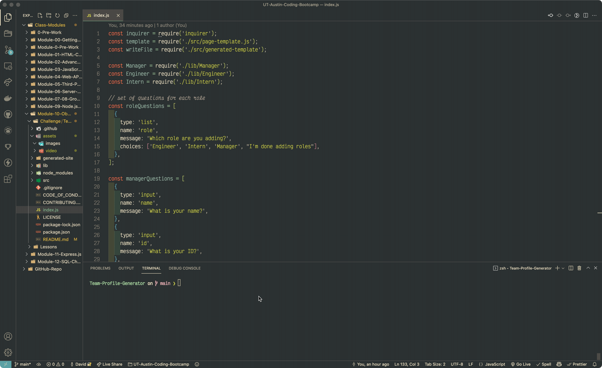

# Module 10 - Team Profile Generator

<h1 align="center">
    <a href="" target="_blank">
     View Demo
    </a>
</h1>
<div align="center">
    
</div>

## Table of Contents
+ [About](#about)
+ [Getting Started](#getting_started)
+ [Usage](#usage)
+ [Built With](#built_with)
+ [Contributing](./CONTRIBUTING.md)
+ [License](./LICENSE.md)
+ [Code of Conduct](./CODE_OF_CONDUCT.md)

## About <a name = "about"></a>
Write about 1-2 paragraphs describing the purpose of your project.

## Getting Started <a name = "getting_started"></a>
These instructions will get you a copy of the project up and running on your local machine for development and testing purposes. See [deployment](#deployment) for notes on how to deploy the project on a live system.

### User Story
```
AS A manager
I WANT to generate a webpage that displays my team's basic info
SO THAT I have quick access to their emails and GitHub profiles
```

### Acceptance Criteria
```
GIVEN a command-line application that accepts user input
WHEN I am prompted for my team members and their information
THEN an HTML file is generated that displays a nicely formatted team roster based on user input
WHEN I click on an email address in the HTML
THEN my default email program opens and populates the TO field of the email with the address
WHEN I click on the GitHub username
THEN that GitHub profile opens in a new tab
WHEN I start the application
THEN I am prompted to enter the team manager’s name, employee ID, email address, and office number
WHEN I enter the team manager’s name, employee ID, email address, and office number
THEN I am presented with a menu with the option to add an engineer or an intern or to finish building my team
WHEN I select the engineer option
THEN I am prompted to enter the engineer’s name, ID, email, and GitHub username, and I am taken back to the menu
WHEN I select the intern option
THEN I am prompted to enter the intern’s name, ID, email, and school, and I am taken back to the menu
WHEN I decide to finish building my team
THEN I exit the application, and the HTML is generated
```

### Prerequisites
What things you need to install the software and how to install them.

### Installing
A step by step series of examples that tell you how to get a development env running.

Say what the step will be

And repeat

End with an example of getting some data out of the system or using it for a little demo.

## Usage <a name = "usage"></a>

Add notes about how to use the system.

## Built With <a name = "built_with"></a>
* [Inquirer](https://www.npmjs.com/package/inquirer)
* [Jest](https://www.npmjs.com/package/jest)
* [Font](https://rubjo.github.io/victor-mono/)
* [Gruvbox Theme](https://github.com/morhetz/gruvbox)